# #️⃣Portfolio Project - Threads Clone App

## Table of contents

- [#️⃣Portfolio Project - Threads Clone App](#️⃣portfolio-project---threads-clone-app)
  - [Table of contents](#table-of-contents)
  - [Overview](#overview)
  - [💾Core Features](#core-features)
    - [📸Screenshots](#screenshots)
      - [📱Mobile](#mobile)
      - [🖥️Desktop](#️desktop)
    - [🔗Links](#links)
    - [⚙️Built with](#️built-with)
    - [👨‍💻Continued development](#continued-development)
  - [Author](#author)

## Overview

A full-stack threads clone application with multi-level comment system, authentication, you can create communities, search for users,
send invites to others to join your community, have discussions on a thread and more.

## 💾Core Features

▶️ Authentication: Authentication using Clerk for email, password, and social logins (Google and GitHub).

▶️ Home Page: View latest threads by your friends and associates, navigate through your feed seamlessly.

▶️ Create Thread: Create a thread that other users will see on their feeds.

▶️ Multi-level comment system: this feature enables community discussions on a thread, providing a structured conversation flow.

▶️ User Search: Enables you to search for friends and associates on the app.

▶️ Activity Page: Displays notifications of your activities on the app.

▶️ Profile Page: Edit your profile i.e change your profile image, username, name, bio etc.

▶️ Create and Invite to Communities: Create a community and invite your friends.

▶️ Community Member Management: A user-friendly interface to manage community members, remove members, delete community, change roles.

▶️ Admin-Specific Community Threads: Enable admins to create threads specifically for their community.

▶️ Blazing-Fast Performance: Optimal performance and instantaneous page switching for a seamless user experience.

▶️ MongoDB with Complex Schemas: Handle complex schemas and multiple data populations using MongoDB.

▶️ File Uploads with UploadThing: File uploads using UploadThing for a seamless media sharing experience.

▶️ Real-Time Events Listening: Real-time events listening with webhooks to keep users updated.

▶️ Next.js Layout Route Groups: Using route groups to organize code and related components

▶️ Data Validation with Zod: Data integrity with data validation using Zod

▶️ Form Management: Efficient management of forms with React Hook Form for a streamlined user input experience.
  
### 📸Screenshots

#### 📱Mobile

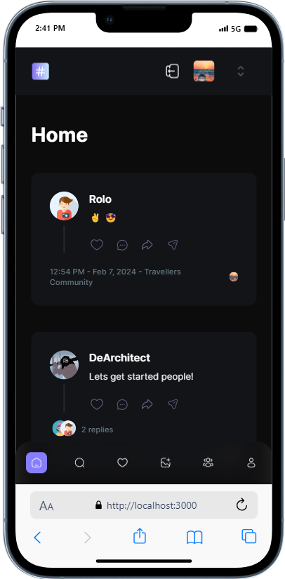
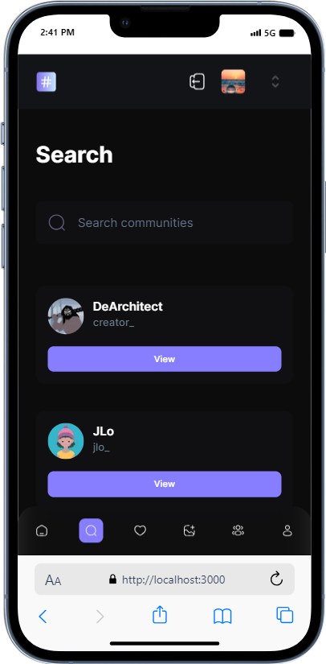
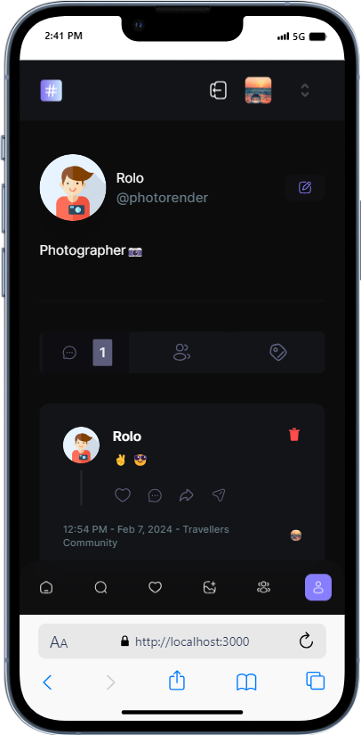
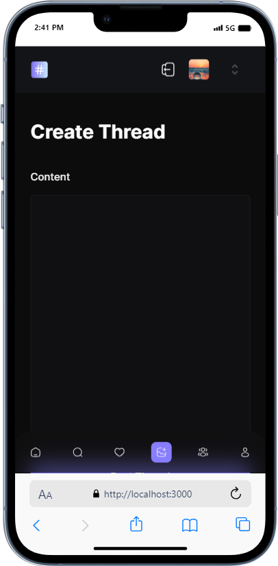
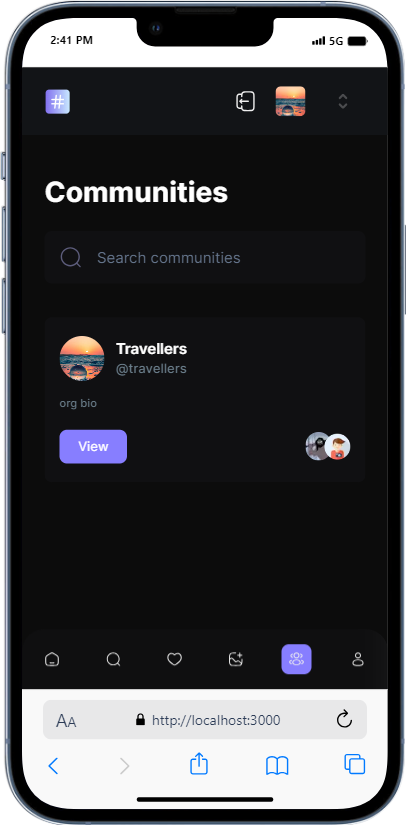

#### 🖥️Desktop

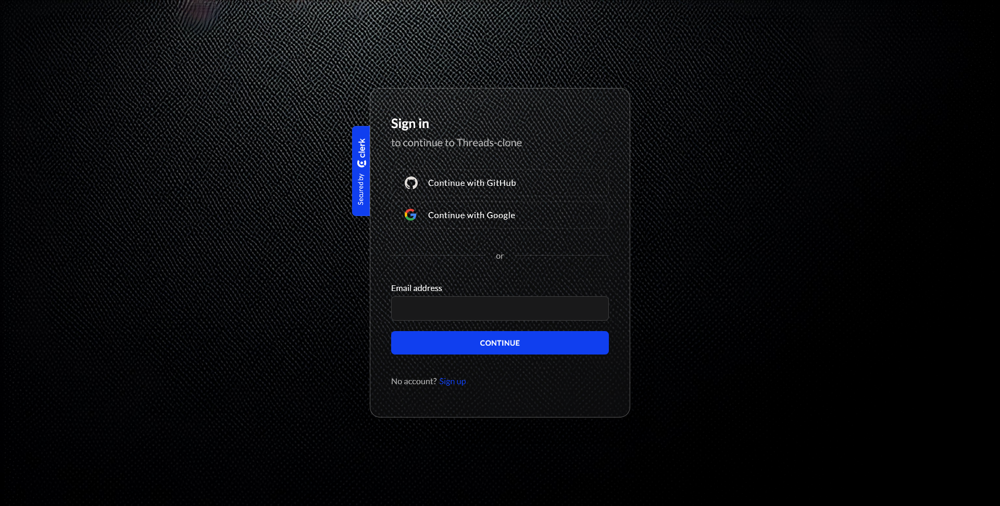
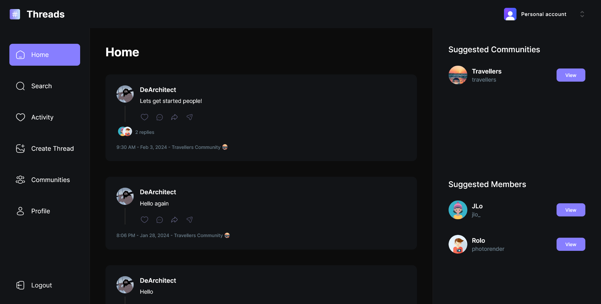
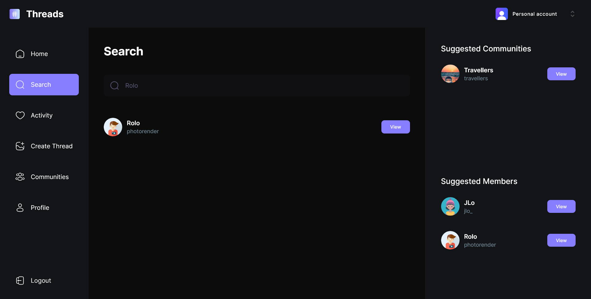
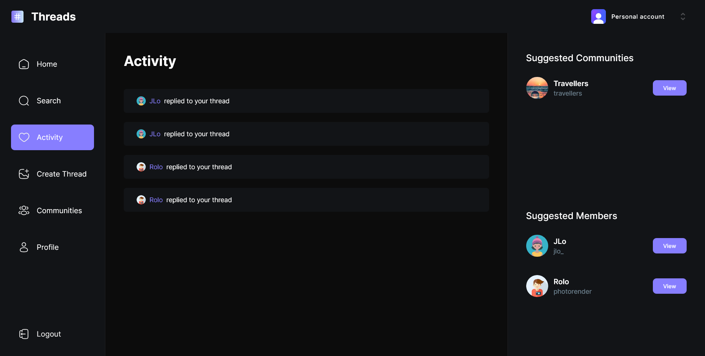
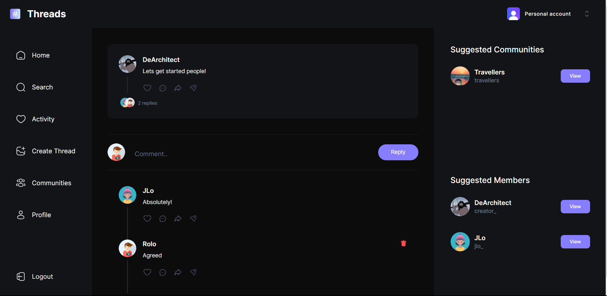
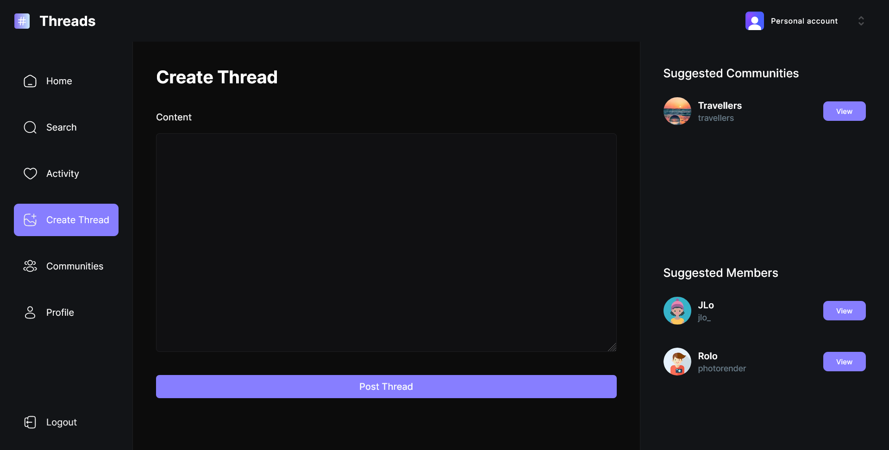
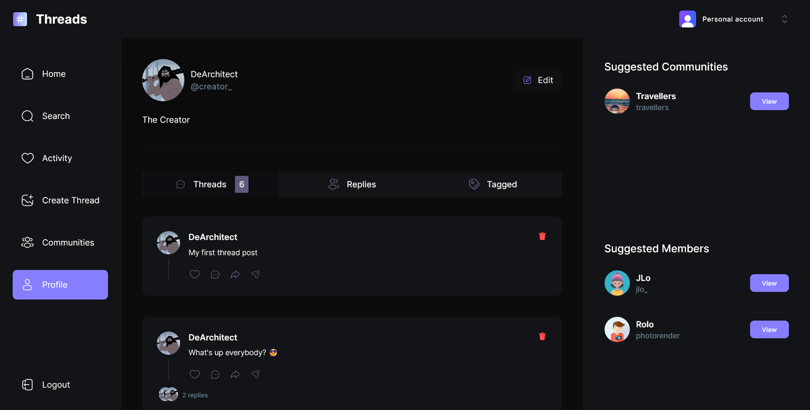
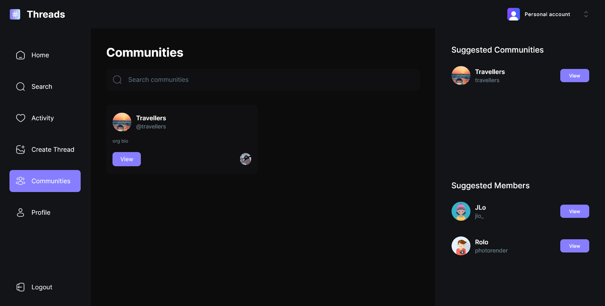
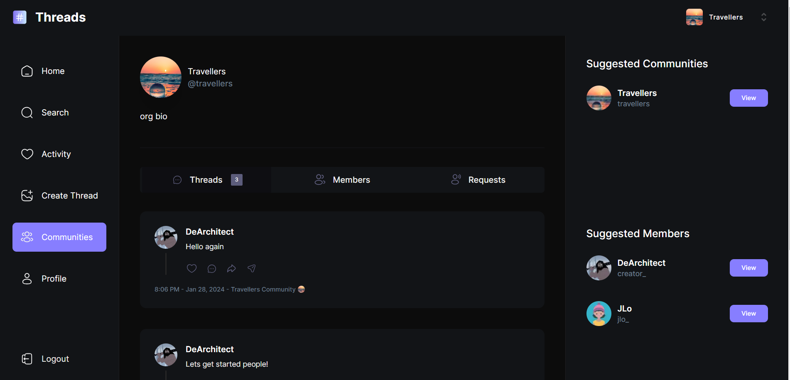

### 🔗Links

- GitHub Repo: [View Repo](https://github.com/Gandah/threads-clone-app.git)
- Live Site URL: [Visit Site](https://threads-app-blue-gamma.vercel.app/)

### ⚙️Built with

- Next.js
- MongoDB
- Shadcn UI
- TailwindCSS
- Clerk Auth
- Clerk Webhooks
- Serverless APIs
- React Hook Form
- Zod
- TypeScript

### 👨‍💻Continued development

- Add replies and requests feature

## Author

- LinkedIn - [MyLinkedIn](https://www.linkedin.com/in/gandahkelvin)
- Website - [Portfolio](https://gandah-porfolio.vercel.app/)
- Twitter - [@mr_g4nderson](https://twitter.com/mr_g4nderson?t=A5NobjZab2sVEdh3Zq9s0A&s=09)
